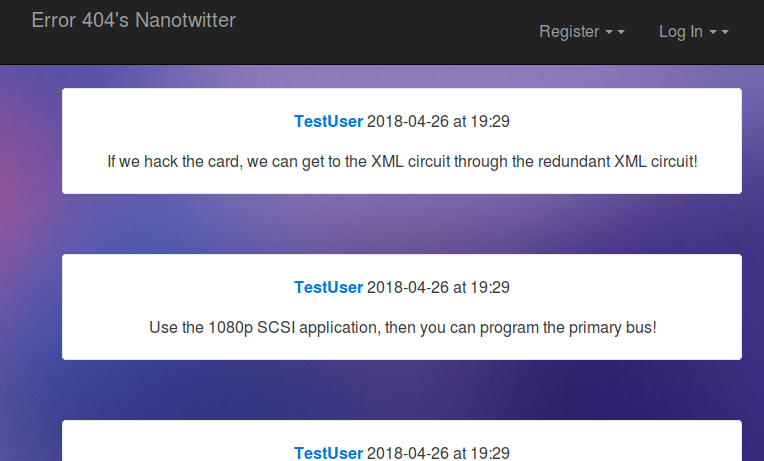
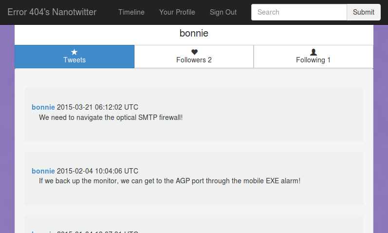

## Welcome to nanoTwitter

## So, what is nanoTwitter?
Just what it sounds like! nanoTwitter is an app that replicates the core functionality of Twitter, but in a much smaller package. Users can send nanoTweets (including hashtags!), follow other users or be themselves followed, search the library of nanoTweets and users, and view timelines. This was a class project for [Cosi 105b - Software Engineering for Scalability](cosi105b.s3-website-us-west-2.amazonaws.com/), taught in the Spring of 2018 by Professor Pito Salas.

## How does it all work?
This app was programmed primarily in Ruby. It was built using Sinatra, a lightweight, domain-specific, web application framework. Though there were specific project requirements, and the app was modeled on Twitter, it was designed and built from the ground up. We use Postgres for our database, Redis for caching, and include RabbitMQ to handle authentication as a microservice. There are also many additional tools and resources we used to build nanoTwitter, but these should give you the basic idea of how it's structured.

## How does it perform?

## Designed and Programmed by...
- Elizabeth Koshalev
- Riely Allen
- Lara Frymark
